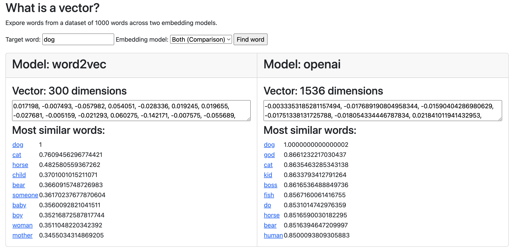

Word2Vec and OpenAI Vector Embeddings
=====================================

This project shows examples of vector embeddings from two language models, [Word2Vec](https://code.google.com/p/word2vec/) and [OpenAI's text-embedding-ada-002 model](https://platform.openai.com/docs/guides/embeddings/what-are-embeddings), using a selection of 1000 words.

For each word, the website shows the vector embedding and the 10 most similar words according to cosine similarity.

Try it out at http://pamelafox.github.io/vectors-comparison/.

Based on (word2vecjson)[https://github.com/turbomaze/word2vecjson] by [Anthony Liu](http://anthony.ai).

## License

MIT License: http://igliu.mit-license.org/
